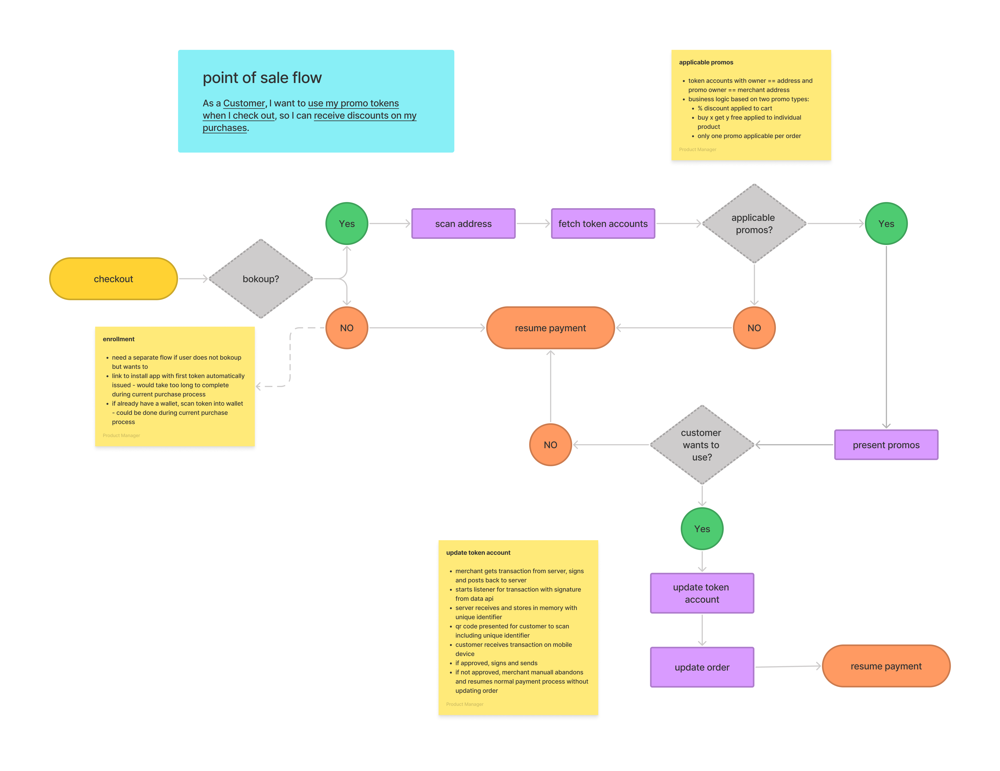

# bokoup

Programs for coupons, promotional offers and loyalty tokens on the Solana blockchain.

## Contents
Complete set up for developing applications to allow merchants to issue and redeem promotional offers and discounts in for the form of semi-fungible tokens.

* On chain programs - see [token metadata specifcations](specifications/token_metadata.md)
* REST api with Solana Pay compliant endpoints for serving on chain transactions and an endpoint for turn key creation of tokens including permanent storage of artwork and metadata - see [transaction server specifications](specifications/transaction_server.md)
* Geyser-plugin and indexer worker to parse program accounts and transactions into Postgres database
* Validator setup to run with geyser-plugin
* Hasura graphl api for application development and reporting
* Web demo application
* Shopify demo application
* Clover point of sale and accompanying android mobile customer applications in separate repository

## Illustrative Point of Sale Flow

