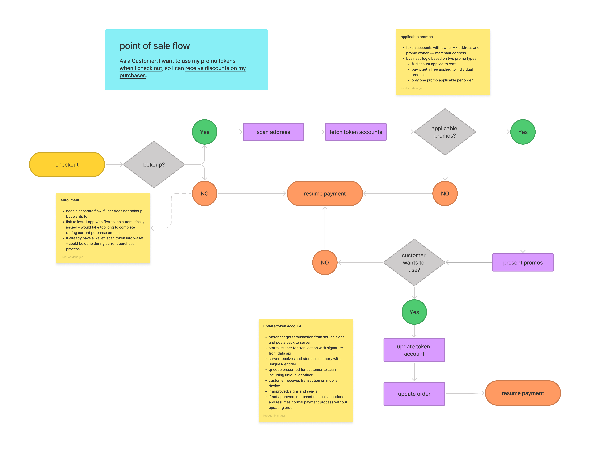

# Token Metadata
## Version: 0.0.1

## Background
In order to utilize on chain tokens to represent promotional discounts and offers, merchants have to be able to relate them to orders, products and discounts in their ecommerce and point of sale systems. In that on chain storage is expensive, it makes sense to store the relevant data in the json metadata typically associated with on chain non-fungible and semi-funbible tokens. We do keep the key values of maximum mintable and maximum burnable tokens on chain in order to enforce them programatically, although these values are repeated in the json metadata to facilitate their display in wallets.

The initial on chain bokoup program utilizes semi-fungible tokens to represent promotional discounts. This form factor is extremely flexible, lending itself to representing one time discounts, multiple or perpetual use discounts or even loyalty points. In an effort to demonstrate the potential value to merchants and their customers of a token based promotional system, bokoup starts off by defining metadata standards for two kinds of promotional offers:

1. Buy x quantity of a product and get y of that product free (buyXProductGetYFree)
1. Buy x currency in total and receive y % off (buyXCurrencyGetYPercent)

Merchants, of course are free to determine their own data standards, but they would need to determine their own business logic for relating those standards to the relevant apis in their sales platforms in order to have a fully functioning system. This is an attempt to define a set of standards along with the business logic that would allow the offers to be applied in sales systems.

As a general matter we conform the specifications to the Metaplex standards so that tokens can be viewed in any wallet that conforms to those standards. As such, we use the array of attributes in the attributes field to define our standards.

Merchants are also free to add additional attributes, for communicating with potential customers or to represent references for internal reporting, for example.

For simplicity sake, the initial demonstration applications allow only one promo token to be applied to each order.

## buyXProductGetYFree

### Specification
```json
{
    "name": "String",
    "description": "String",
    "image": "URL -> String ",
    "attributes": [
        {
            "trait_type": "promoType",
            "value": "buyXProductGetYFree",
        },
        {
            "trait_type": "productId",
            "value": "String",
        },
        {
            "trait_type": "buyXProduct",
            "value": 3 // Integer
        },
        {
            "trait_type": "getYProduct",
            "value": 1 // Integer
        },
        {
            "trait_type": "maxMint",
            "value": 1000 // Integer
        },
        {
            "trait_type": "maxBurn",
            "value": 250 // Integer
        },
    ],
    "collection": {
        "name": "String",
        "family": "String"
    },
    "properties": {
        "files": [
            {
                "uri": "URL -> String",
                "type": "MimeType -> String"
            },
        ],
        "category": "image"
    }
}
```
### Business Logic
This will determine whether the buyXProduct threshold has been met for each product in the current order and then calculate a discount for each based on the current price of the product as found in the point of sale system and the quantity in getYproduct of applicable promo.

1. Get all products in the order with quanitities and prices
1. Get all buyXProductGetYFree promo tokens for the merchant with products of sufficient quantity in the order
1. Get all related token accounts for the customer with amounts greater than zero
1. Calculate discount amount for each eligible token account based on quantity specified in the promo by getYProduct and the price as included with products

## buyXCurrencyGetYPercent

### Specification
```json
{
    "name": "String",
    "description": "String",
    "image": "URL -> String ",
    "attributes": [
        {
            "trait_type": "promoType",
            "value": "buyXCurrencyGetYPercent",
        },
        {
            "trait_type": "buyXCurrency",
            "value": 3 // Integer in 100ths of currency, i.e, 100 for 1 unit of currency
        },
        {
            "trait_type": "getYPercent",
            "value": 1 // Integer in percents, i.e., 10 equals 10 percent
        },
        {
            "trait_type": "maxMint",
            "value": 1000 // Integer
        },
        {
            "trait_type": "maxBurn",
            "value": 250 // Integer
        },
    ],
    "collection": {
        "name": "String",
        "family": "String"
    },
    "properties": {
        "files": [
            {
                "uri": "URL -> String",
                "type": "MimeType -> String"
            },
        ],
        "category": "image"
    }
}
```

### Business Logic
This will determine whether the buyXCurrency threshold has been met for each outstanding buyXCurrencyGetYPercent promo token owned by the merchant with burnCount less than maxBurn.

1. Get all merchant buyXCurrencyGetYPercent promos with burnCount less than maxBurn and buyXCurrency less than or equal to the total order amount
1. Get all related token accounts for the customer with amounts greater than zero
1. Calculate discount amount for each eligible token account based total amount of the order and the discount percentage specified in the promo by getYPercent


## Purchase Flow
